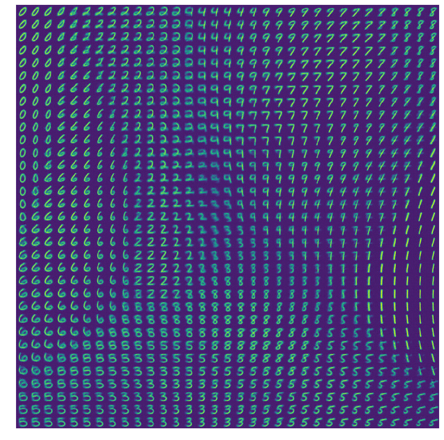

VAE experiments
===============

General observations:

- Start with a small dataset subset to early catch any errors. The network should be able to easily remember all samples.
- CIFAR is very difficult and it's really better to stick to the MNIST for VAE.

Obligatory grid of images generated from 2d latent space on MNIST:
-------------------------------------------------------

Sigmoid 0-1 pixel value constraints
-----------------------------------

Pixel distribution without sigmoid:

Pixel distribution wit sigmoid:

- The figures above show histograms of the pixel intensity values.
- The original image distributions are on the left. The predicted distributions are on the right.
- The orange line shows the histogram for the raw output values while the blue line and bars show the clipped values (clipping is not required for sigmoid).

One might presume that performing clipping might cause most of the probability mass to focus on the edge values 0 and 1 since all values that lied beyond that range would be snapped into one of those values. This is actually the case for the value of 1 where we can observe a large peek.

Such peek can be also observed for the original image distribution, however the plot around this peek seems to be smoother. Similar smoothness can be observed for the sigmoid predictions, but the height of the peek is usually much lower.
